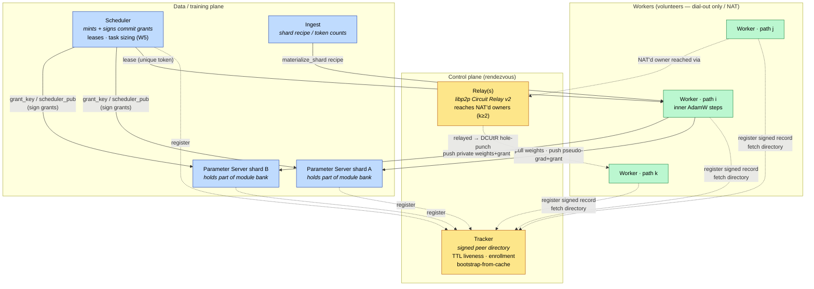
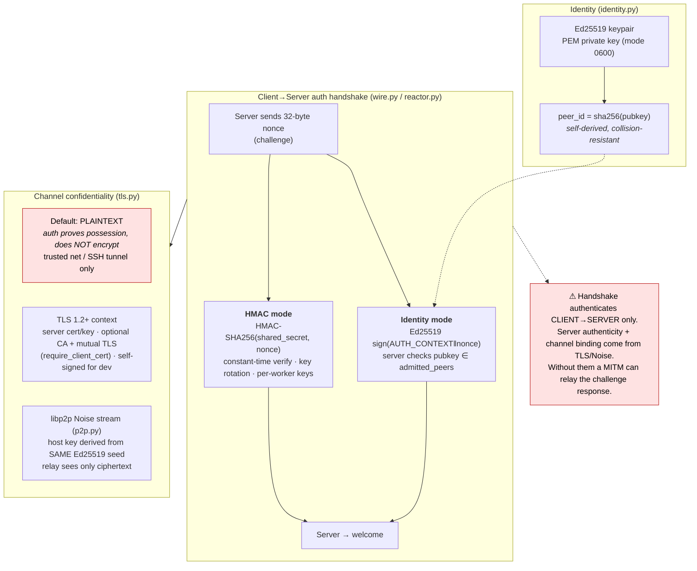
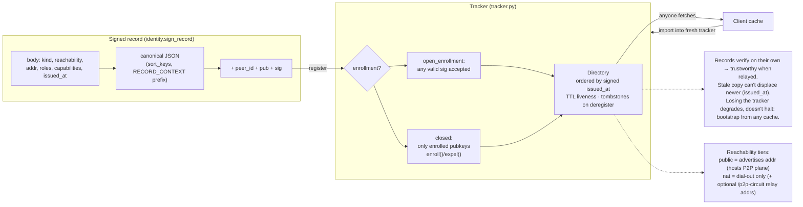
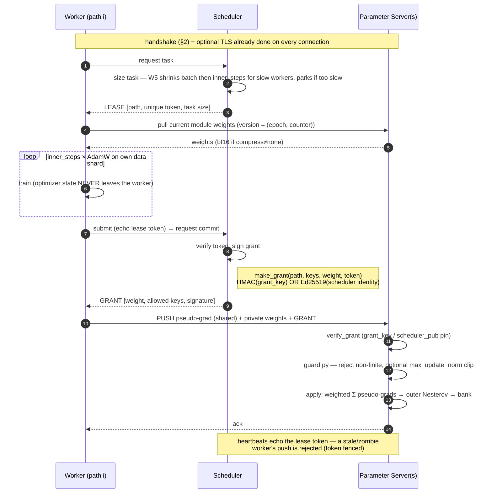
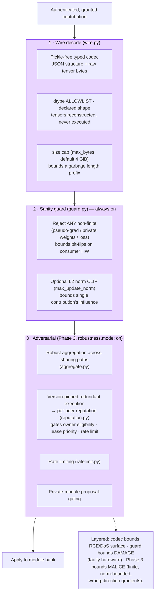
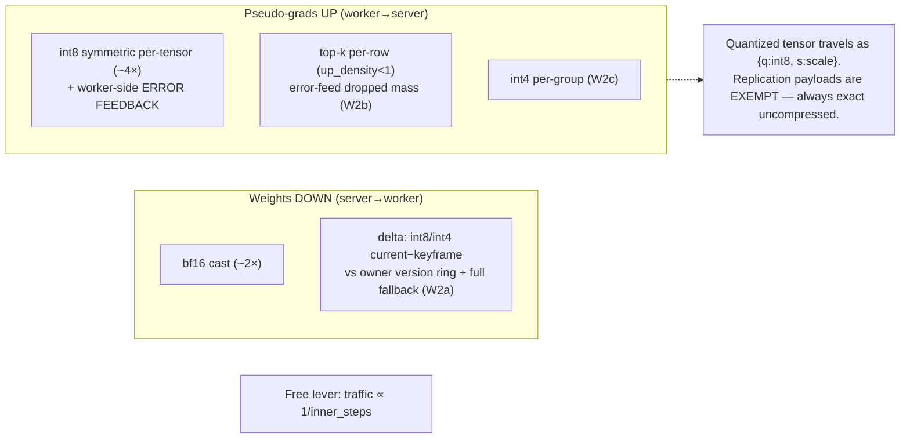
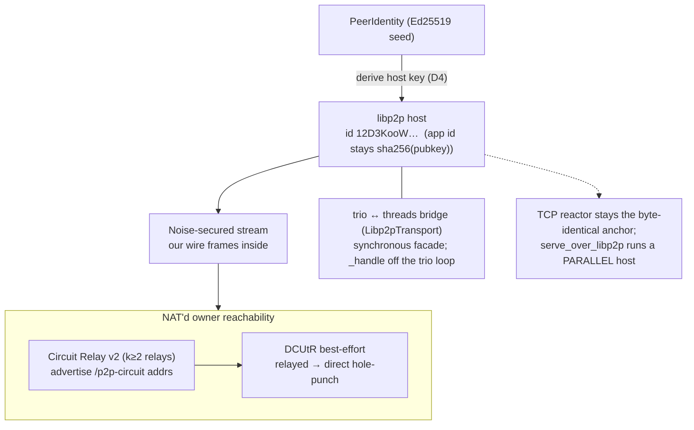

# Security & Network Model

How OpenDiPaCo nodes find each other, authenticate, move weights/gradients, and
defend the shared module bank. Sources: `schedule/{wire,reactor,identity,tls,tracker,guard,compress,sharded}.py`,
`schedule/p2p.py`, and the design docs under `docs/` (W1 NAT, W2 bandwidth,
Phase 2–4).

## 1. Roles & topology

`world_size` must divide `num_paths`. The scheduler can be removed entirely in
`schedule.mode: decentralized` (Phase 4): each path's **primary owner** mints
its own grants and the tracker becomes a pure bootstrap seed.

## 2. Identity, authentication & channel security

Key facts:
- **peer_id = `sha256(raw pubkey)`** — `verify_record` rejects a record whose
  `peer_id` isn't honestly derived from its embedded `pub`, so you can't sign
  someone else's id with your own key.
- HMAC keys normalize to a *set* on the server (`acceptable_keys`): rotate by
  listing old+new; revoke by dropping a key. The node's own `auth_key` doubles
  as its client identity.
- TLS is **off by default**. The wire format already unpickles nothing, so the
  threat TLS closes is **confidentiality** (on-path reading of weights/grads),
  not RCE.

## 3. Self-certifying records & the rendezvous tracker

## 4. Data movement: lease → train → grant → commit

The core transport invariant: **a PS push requires the scheduler's single-use
commit grant**, and a **lease token** fences zombie workers.

Invariants enforced on this path:
- **Lease token** — unique per lease; echoed on submit/nack/heartbeat. Fences a
  zombie worker whose lease was reassigned.
- **Commit grant** — single-use, carries the allowed keys + weight.
  - `grant_key` set → **HMAC-SHA256** signed (kept secret from workers).
  - scheduler `identity=` + servers pin `scheduler_pub=` → **Ed25519** signed;
    this **refuses HMAC/unsigned grants outright** (no downgrade).
  - `schedule.mode: decentralized` → grant signed by the path's **primary
    owner**; co-owners verify the signer against the epoch record (`grant_signed_by`).
- **Optimizer state never crosses the wire** (`bytes_opt` metric stays 0).
- **Version = `(epoch, counter)`** must always identify identical bytes: owner
  banks built with a shared `bank_seed` so `(0,0)` matches everywhere;
  replication pulls ship exact uncompressed state (never bf16 a replication payload).

## 5. Server-side defense of the bank

## 6. Wire compression (changes bytes, not trust)

All off by default; the "off" path is byte-identical. Self-describing payloads,
decode boundary Byzantine-hardened.

## 7. libp2p / NAT traversal (W1, `transport.kind: libp2p`)

---

### Threat-model summary

| Layer | Mechanism | Defends against |
|---|---|---|
| Serialization | pickle-free typed codec, dtype allowlist, size cap | RCE via deserialization, oversized-prefix DoS |
| AuthN | HMAC challenge **or** Ed25519 challenge (`admitted_peers`) | unauthenticated clients |
| Channel | TLS 1.2+ (opt mutual) / libp2p Noise | on-path eavesdropping, server impersonation (with verify) |
| Directory | self-certifying signed records, TTL, tombstones | forged/replayed/stale peer records, tracker as SPOF |
| Authorization | lease token (fence) + single-use commit grant (HMAC/Ed25519/owner) | zombie workers, unauthorized PS writes, grant downgrade |
| Bank integrity | non-finite reject (always) + optional norm clip | faulty-hardware poisoning, oversized contributions |
| Adversarial | robust aggregation + reputation + rate limit + proposal-gating | Byzantine wrong-direction gradients, Sybil influence |
| Secret hygiene | optimizer state never shipped; PEM key 0600; `grant_key` secret from workers | state leakage, key theft |
